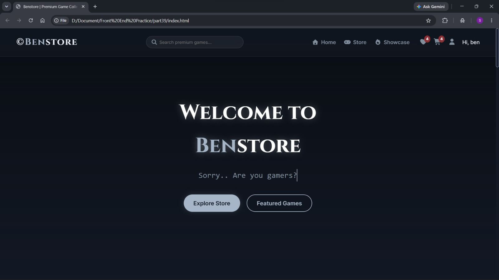
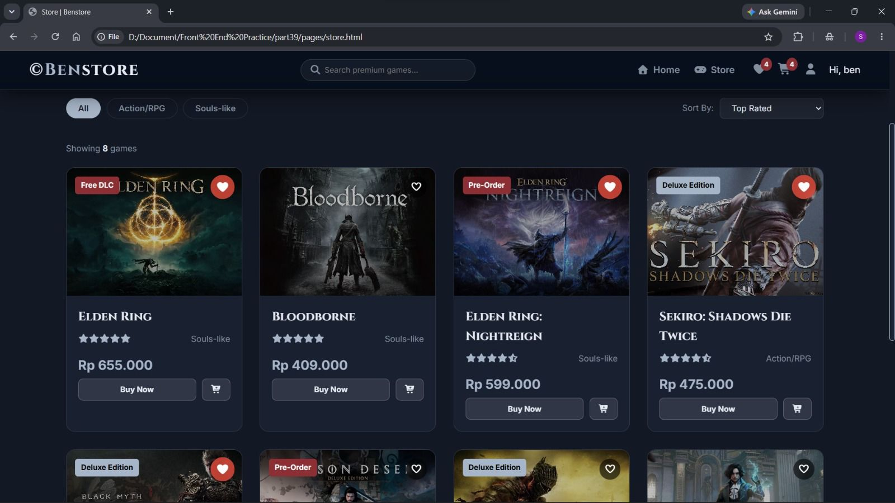
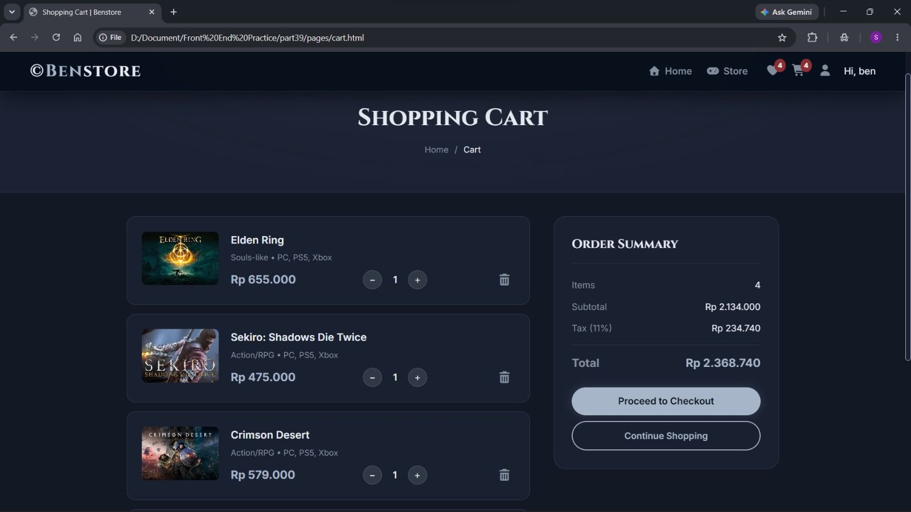
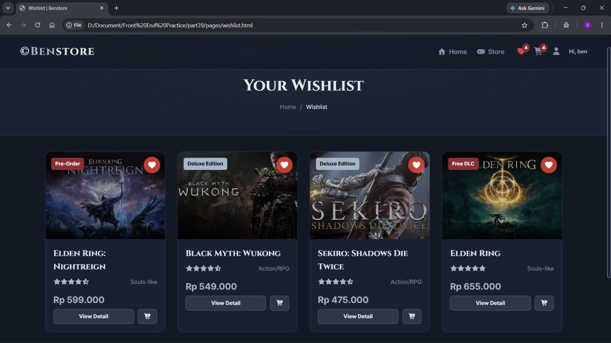
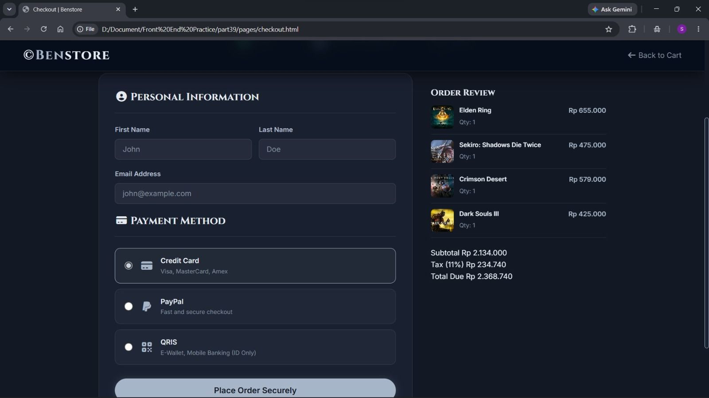

# 🎮 Benstore

A responsive gaming e-commerce platform built with HTML, CSS, and JavaScript, designed to provide an engaging digital game shopping experience. The application features product browsing, search and filtering, shopping cart management, wishlist functionality, authentication simulation, and checkout workflow.

## 🚀 Features

- User Authentication (Login & Registration)
- Product Catalog Management
- Search & Filtering System
- Shopping Cart Functionality
- Wishlist Management
- Checkout Workflow
- Responsive Design for Desktop & Mobile
- Local Storage Data Persistence

## 🛠️ Technologies Used

- HTML5
- CSS3
- JavaScript (ES6)
- Local Storage API
- Responsive Web Design

## 📸 Screenshots

### Homepage

Modern landing page featuring promotional banners, featured products, and intuitive navigation.

---

### Product Catalog

Dynamic product catalog with search and filtering functionality for efficient product discovery.

---

### Shopping Cart

Interactive shopping cart allowing users to manage selected products and review purchase summaries.

---

### Wishlist

Wishlist feature enabling users to save favorite products for future purchases.

---

### Checkout

Streamlined checkout process for reviewing orders and completing purchases.

## 💡 Project Highlights

- Developed a complete front-end e-commerce workflow.
- Implemented client-side data persistence using Local Storage.
- Designed a responsive user interface for multiple screen sizes.
- Applied modular JavaScript for interactive user experiences.
- Focused on usability, accessibility, and modern UI principles.

## 🎯 Learning Outcomes

Through this project, I strengthened my skills in:

- Front-End Development
- DOM Manipulation
- JavaScript Programming
- Responsive Web Design
- State Management using Local Storage
- User Interface & User Experience Design

## 👨‍💻 Author

**Salman Annuroddin MB**

Web Developer | Front-End Developer

---

⭐ If you found this project interesting, feel free to explore the repository and provide feedback.
